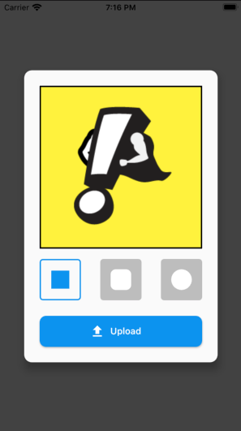
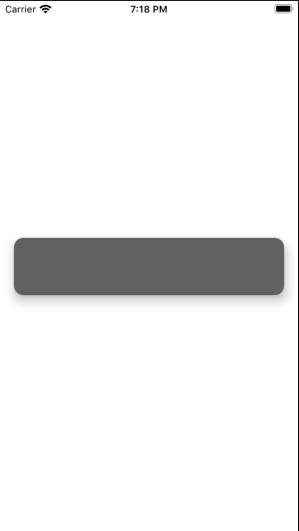
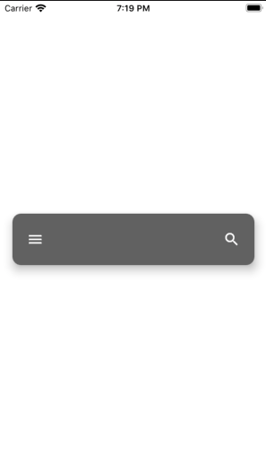

# Workshop Instructions: Widgets

### Exercise 1: Break-up a big widget tree

When you run Exercise 1, you will see a UI that displays a dialog in the center of the screen. That dialog includes an avatar image, 3 small buttons to contorl the shape of the avatar, and a button to upload the avatar.

This entire UI was created with a single, unwieldy widget tree. This is bad for readability, re-usability, and generally encourages bugs.

Your job is to breakdown this widget tree into a combination of custom stateless widgets and local methods to help reduce the complexity of the tree.

### Exercise 2: Finish an app bar implementation

When you run Exercise 2, you will see a wide, narrow rectangle with rounded corners. 

We want this rectangle to look like a kind of app bar. 

We'd like a menu icon button on the left side this rectangle, a search icon button on the right side of this menu, and we'd like a text field to sit beteen these two buttons, taking up all available space.

Add the widgets necessary to create the desired end-product.